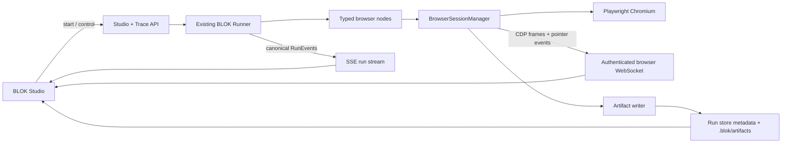

# BLOK Studio Workflow Canvas

> Status: implementation plan · 2026-08-03
> Priority: E2E browser workflows first, general workflow authoring second
> Scope: `apps/studio`, runner trace/control APIs, browser nodes, workflow authoring metadata
> Inputs: current BLOK source, ION/ATOMIC source study, supplied BuildShip references and prototype, existing S4/S5 specs, existing n8n research

## 1. Outcome

BLOK Studio becomes the place where an author can:

1. Open or create a workflow on a visual canvas.
2. Configure typed nodes without losing access to code.
3. Run the workflow and watch the same canvas become a live execution view.
4. For browser workflows, watch Chromium navigate, type, click, and assert in a synchronized browser panel.
5. Pause, continue, or step through a debug run without losing browser state.
6. Inspect every node's inputs, outputs, logs, errors, screenshots, and browser artifacts.
7. Reopen a finished run and replay its exact timeline.

The defining product promise is:

> One workflow, one runner, one event timeline, one canvas. Browser testing is a typed BLOK capability, not a second automation framework hidden inside Studio.

E2E browser workflows are the first-class design target because they exercise every important surface at once: authoring, execution, live feedback, cancellation, assertions, artifacts, debugging, and replay.

## 2. Decisions now frozen

| Decision | Choice | Reason |
|---|---|---|
| Workflow engine | Existing BLOK runner | Avoid a Playwright-only execution engine and preserve all current reliability/tracing behavior. |
| Browser implementation | Playwright + Chromium first | Official, deterministic baseline. Do not add a Patchright abstraction before a real requirement exists. |
| Browser actions | Normal typed BLOK nodes | They participate in handles, retries, timeouts, logs, traces, control flow, and sub-workflows like every other node. |
| Live execution authority | Runner trace events | Studio projects one canonical event stream into canvas, inspector, terminal, and browser. |
| Canvas source | Workflow IR projected through `buildWorkflowDag()` | Reuse the existing nested control-flow model and structural edit operations. |
| Layout persistence | Per-workflow `*.studio.json` sidecar | Layout is versionable but does not pollute executable workflow code or runtime configuration. |
| Existing inline `step.ui` | Backward-compatible read fallback | Current schemas and normalizer already preserve it; Studio writes the sidecar going forward. |
| Runtime artifacts | `.blok/artifacts/<runId>/` plus run-store metadata | Artifacts are generated data and must not be committed with workflow layout. |
| Editor state | Explicit draft + Save | Avoid saving half-configured nodes and provide predictable undo/redo. |
| Undo/redo | Capped whole-draft snapshots | Workflow documents are small; no command framework or CRDT is justified. |
| Debug controls | Run, Debug, Step-through | Automatic runs stay fast; debug runs pause only when requested. |
| Browser streaming | Chromium CDP screencast over an authenticated Studio WebSocket | Gives genuine live pixels without VNC, headed desktop infrastructure, or screenshot polling. |
| Saved screenshots | One after each browser action by default | Provides deterministic replay even when the live stream was not watched. |
| TS write-back | Never rewrite handwritten TS lossily | Layout sidecars work for TS. Logic editing initially targets Studio-owned v2 JSON IR; deterministic typed-DSL export is a later, explicit feature. |

## 3. Existing foundations to reuse

This is not a greenfield canvas.

| Existing capability | Location | Plan |
|---|---|---|
| Static workflow IR → DAG | `apps/studio/src/lib/workflowDag.ts` | Keep as the only graph projection. Extend metadata; do not create a parallel graph model. |
| React Flow renderer + Dagre | `apps/studio/src/components/trace/WorkflowGraph.tsx` | Turn into a reusable editable/live canvas shell. Keep auto-layout fallback. |
| Nested IR edit operations | `apps/studio/src/lib/irEditOps.ts` | Reuse insert/delete/move/rename/ref propagation. Do not rewrite tree traversal. |
| Layout pins from `step.ui` | `WorkflowGraph.tsx` + `WorkflowNormalizer.ts` | Adapt `layoutDag()` to accept sidecar positions first and inline `ui` second. |
| Zod workflow validation | `core/workflow-helper` | Use the existing workflow schemas on every save. No Ajv or second validator. |
| Node catalog + schemas | `triggers/http/src/runner/nodeCatalog.ts` | Power the palette and schema-driven inspector. |
| Per-run REST + SSE | `TraceRouter.ts`, `useRunDetail.ts`, `sse.ts` | Extend the existing event contract rather than introducing a Studio-only event bus. |
| Inputs, outputs, logs, metrics | Run store and Studio trace components | Reuse in the canvas inspector and activity drawer. |
| Cancellation | RunTracker AbortController integration | Browser sessions and Playwright calls must honor the same `ctx.signal`. |
| Replay lineage | Existing replay endpoint/run fields | Reuse for HTTP workflows and add a general Studio test-run endpoint for non-HTTP/manual runs. |
| Node testing | `NodeTestHarness` | Keep for stateless node tests; browser workflows use run-to-node/debug because session state matters. |
| Studio design tokens | `brand-spec.md`, `app.css` | Preserve the calm operator palette and BLOK green signature. |

Important current gaps:

- `WorkflowGraph` is still read-only despite layout/IR groundwork.
- There is no workflow draft store, palette, inspector save path, or authoring API.
- Registry `source` is not always a canonical filesystem path for TS workflows.
- No Playwright dependency, browser nodes, session manager, artifact store, or live-browser transport exists.
- The trace protocol has node lifecycle events but no browser-frame/action/artifact events.
- The runner has no paused/debug run state or continue/step control.
- The existing Studio redesign plan explicitly excluded authoring; this document supersedes only that non-goal. Its operator/run-detail work remains useful.

## 4. Product modes

Studio uses one workspace with four modes. The canvas remains spatially stable while the surrounding tools change.

### 4.1 Build

Primary job: create and configure workflow structure.

- Left: workflow switcher and searchable node palette.
- Center: editable infinite canvas.
- Right: selected-node inspector.
- Bottom: validation/problems drawer, collapsed by default.
- Top: workflow name, saved/dirty state, undo/redo, auto-layout, Run, Debug.

Core interactions:

- Drag a catalog node onto an insertion target.
- Drag from a node output to open a contextual, filtered node picker.
- Select a node to edit Inputs, Logic, Output schema, Settings, and Test.
- Connect data through a schema/trace value picker; do not ask authors to type internal mapper strings.
- Drop control-flow nodes as visible containers with named arms.
- Save explicitly; invalid drafts remain local and cannot overwrite a valid workflow.

### 4.2 Run

Primary job: execute quickly and observe.

- Canvas nodes transition pending → running → completed/failed/skipped/cached.
- Edges animate only while they represent active execution.
- Active node is brought into view without constantly recentering the user's viewport.
- Browser panel opens automatically when the run creates a browser session.
- Activity drawer streams logs, assertions, and artifacts.
- Clicking any completed node freezes the inspector on that node while the run continues.

### 4.3 Debug

Primary job: understand or author a stateful flow node by node.

- `Debug` pauses on explicit breakpoints.
- `Step-through` pauses before every executable node.
- Controls: Continue, Step, Stop, Skip only when the runner can represent skip safely.
- The browser session, page, cookies, and storage stay alive while paused.
- Inspector exposes resolved inputs before execution and output immediately after completion.
- Pause has a visible TTL countdown; expiry cancels the run and closes resources.

### 4.4 Replay

Primary job: reconstruct what happened without executing again.

- Replays persisted node events against the canvas timeline.
- Browser panel uses saved per-action screenshots first; optional video/trace artifacts later.
- Timeline scrubber selects a point in the run.
- Node inspector displays the historical inputs/outputs/errors for that point.
- Replay never mutates the workflow or pretends to be a live browser session.

## 5. E2E-first workspace UX

### 5.1 Default running layout

```text
┌──────────────────────────────────────────────────────────────────────────────┐
│ BLOK Studio · Login flow         Run ▾  Debug  Stop     Running · Fill email │
├───────────────┬──────────────────────────────┬───────────────────────────────┤
│ WORKFLOWS     │ CANVAS                       │ LIVE BROWSER                  │
│               │                              │ https://app.test/login        │
│ Browser tests │ Launch ✓                     │                               │
│  Login        │    ↓                         │  Email [alice@example.com]    │
│  Checkout     │ Navigate ✓                   │  Password [••••••••]          │
│               │    ↓                         │  [ Sign in ]                  │
│ BLOK flows    │ Fill email ●                 │            cursor ◉           │
│  Welcome      │    ↓                         │                               │
│               │ Fill password                │                               │
├───────────────┴──────────────────────────────┴───────────────────────────────┤
│ ACTIVITY · Logs | Step data | Assertions | Network | Artifacts               │
└──────────────────────────────────────────────────────────────────────────────┘
```

All primary panes are resizable. The product supplies three focus shortcuts:

- Canvas focus.
- Browser focus.
- Split view.

The browser panel never forces nodes into unusably small cards. When space is constrained, side panels collapse before the canvas changes its node information hierarchy.

### 5.2 Browser panel

Header:

- Current URL, loading state, page title.
- LIVE/PAUSED/REPLAY badge.
- Viewport and device preset.
- Pop out, focus, reload only in an author-controlled debug session.

Viewport:

- Real Chromium frames, letterboxed to preserve aspect ratio.
- Pointer overlay driven by browser action events.
- Click ripple and typed-field highlight are presentation overlays; they must not slow deterministic test execution unless `slowMotion` is explicitly enabled.
- Current locator target receives a short outline and accessible label.

Footer/secondary tools:

- Console, Network, Storage, Screenshots, Playwright trace.
- These land incrementally; the initial vertical slice requires screenshots and console errors only.

### 5.3 E2E node inspector

Tabs:

1. **Action** — locator, value, URL, wait policy, assertion.
2. **Inputs** — resolved values and upstream handles.
3. **Output** — locator resolution, URL, timings, assertion result.
4. **Artifacts** — before/after screenshots and trace links.
5. **Settings** — timeout, retry, continue-on-failure, sensitive-value masking.

Test controls depend on node type:

- Stateless node: `Test node` using the existing harness.
- Browser action: `Run to here`, because launch/navigation/session prerequisites matter.
- Active paused browser node: `Run this step` against the live session.

### 5.4 Assertions

Assertions are nodes, not special canvas decorations. They receive the browser session handle and produce a typed result.

Successful assertion:

- Green node completion.
- Expected and actual summary in Output.
- Optional screenshot artifact.

Failed assertion:

- Red node and incoming edge.
- Browser freezes on the failure frame.
- Inspector leads with expected vs actual, locator resolution, URL, and screenshot.
- Terminal includes the Playwright error without burying the BLOK step identity.

## 6. Workflow Studio sidecar

### 6.1 Location rule

The canonical rule is: replace the workflow source extension with `.studio.json`.

```text
src/workflows/login.ts             → src/workflows/login.studio.json
workflows/json/login.json          → workflows/json/login.studio.json
src/workflows/login/workflow.ts    → src/workflows/login/workflow.studio.json
```

This supports flat and folder-based projects without introducing two lookup conventions.

The registry must expose a canonical filesystem `sourcePath`. Entries such as `Workflows.ts["login"]` are display provenance, not a writable path; Studio logic remains read-only until the real source path is known.

### 6.2 Version 1 contract

```json
{
  "$schema": "https://blok.build/schemas/workflow-studio.v1.json",
  "schemaVersion": 1,
  "workflow": "login-flow",
  "canvas": {
    "direction": "TB",
    "defaultViewport": { "x": 0, "y": 0, "zoom": 1 }
  },
  "nodes": {
    "launch": { "x": 340, "y": 80 },
    "fill-email": {
      "x": 340,
      "y": 360,
      "collapsed": false,
      "notes": "Use the account fixture"
    }
  },
  "groups": {},
  "annotations": []
}
```

Required rules:

- `schemaVersion` is an integer and the only format discriminator.
- `workflow` must match the registered workflow name before save.
- `nodes` is keyed by stable step id, never display label or build-order id.
- Coordinates must be finite numbers and bounded to a generous safe range.
- Unknown future keys round-trip unchanged.
- Missing/orphan node ids are ignored on render and retained on save unless the user chooses `Clean layout`.
- Synthetic trigger/end/merge nodes auto-layout in v1; do not persist unstable synthetic ids.
- `defaultViewport` changes only through an explicit `Save current view as default` action. Normal pan/zoom is user-local.

### 6.3 Data ownership

Committed sidecar:

- Node positions.
- Collapsed shared containers.
- Author notes, groups, frames, and sticky annotations.
- Explicitly saved default viewport and layout direction.

Local browser storage:

- Last pan/zoom.
- Selected node and open inspector tab.
- Panel widths.
- Temporary breakpoints and pinned sample data.
- Unsaved draft recovery.

Workflow/runtime definition:

- Node inputs and workflow logic.
- Browser viewport/device when it affects test behavior.
- Timeouts, retries, locator strategy, assertions.
- Secrets or connection references.

Run artifact storage:

- Screenshots, video, Playwright traces, DOM snapshots, console/network records.
- Never store these in the sidecar.

### 6.4 Compatibility and migration

Read precedence:

1. `*.studio.json` position.
2. Inline `step.ui` position.
3. Dagre auto-layout.

Save behavior:

- Studio writes only the sidecar for layout changes.
- Inline `step.ui` remains untouched unless the user explicitly runs a migration command.
- `blokctl migrate studio-layout <workflow>` copies inline positions/notes to the sidecar and reports orphan keys.
- Runner execution never reads the sidecar.

## 7. Browser workflow authoring model

### 7.1 Typed session handle

`browser.launch` returns only serializable identity:

```ts
{
  sessionId: string;
  pageId: string;
  browser: "chromium";
}
```

The real `Browser`, `BrowserContext`, and `Page` objects stay inside an in-process session manager. They never enter `ctx.state`, traces, JSON, or cross-runtime transport.

Every browser node accepts `{ sessionId, pageId }`. The manager verifies that the token belongs to the current run, preventing one workflow from attaching to another run's browser.

### 7.2 Initial node set

Ship the minimum coherent E2E set:

| Node | Purpose |
|---|---|
| `@blokjs/browser-launch` | Launch Chromium context/page and return the session handle. |
| `@blokjs/browser-goto` | Navigate and wait for the configured load state. |
| `@blokjs/browser-click` | Resolve one strict locator and click it. |
| `@blokjs/browser-fill` | Resolve one strict locator and replace its value. |
| `@blokjs/browser-press` | Send a keyboard key/combo to a target or page. |
| `@blokjs/browser-select` | Select a native option. |
| `@blokjs/browser-wait` | Wait for URL, load state, visibility, or a bounded duration. |
| `@blokjs/browser-assert-visible` | Assert target visibility. |
| `@blokjs/browser-assert-text` | Assert text using exact/contains/matches modes. |
| `@blokjs/browser-assert-url` | Assert exact/contains/matches URL. |
| `@blokjs/browser-screenshot` | Capture a named artifact explicitly. |
| `@blokjs/browser-close` | Close early; terminal run cleanup remains automatic. |

Do not add a generic `execute JavaScript` node initially. It bypasses the typed model and becomes an attractive escape hatch before normal actions are proven insufficient. Add it only as a clearly marked advanced node when real tests require it.

### 7.3 Locator contract

Locators are structured and strict by default:

```ts
type BrowserLocator =
  | { by: "testId"; value: string }
  | { by: "role"; role: string; name?: string; exact?: boolean }
  | { by: "label"; value: string; exact?: boolean }
  | { by: "placeholder"; value: string; exact?: boolean }
  | { by: "text"; value: string; exact?: boolean }
  | { by: "css"; value: string };
```

Inspector order mirrors preferred reliability: test id → semantic role/name → label/placeholder → text → CSS escape hatch.

Locator resolution output includes:

- Strategy and normalized locator.
- Match count.
- Target bounding box when available.
- Accessible name/role when available.
- Duration.

Zero or multiple matches fail before the action unless a node explicitly opts into a multiple-element operation.

### 7.4 Example typed workflow

```ts
const browser = step("browser", launchBrowser, {
  browser: "chromium",
  viewport: { width: 1440, height: 900 },
});

step("open-login", browserGoto, {
  session: browser,
  url: "https://app.example.com/login",
});

step("fill-email", browserFill, {
  session: browser,
  locator: { by: "label", value: "Email" },
  value: req.body.email,
});

step("submit", browserClick, {
  session: browser,
  locator: { by: "role", role: "button", name: "Sign in" },
});

step("dashboard", assertUrl, {
  session: browser,
  matches: "/dashboard/",
});
```

The browser handle is passed like any other typed output. Workflow ordering remains the BLOK step order; browser nodes do not invent connections.

## 8. Runtime architecture



### 8.1 BrowserSessionManager

One in-process manager owns live browser resources:

```ts
type BrowserSessionRecord = {
  sessionId: string;
  runId: string;
  browser: Browser;
  context: BrowserContext;
  pages: Map<string, Page>;
  createdAt: number;
  lastActivityAt: number;
  status: "live" | "closing" | "closed";
};
```

Responsibilities:

- Generate unguessable session/page ids.
- Bind sessions to `ctx.id`/run id.
- Resolve and validate handles for browser nodes.
- Own CDP screencast subscriptions.
- Register console/page errors and artifact capture.
- Close all resources on success, failure, cancellation, timeout, client disconnect when configured, and process shutdown.
- Enforce per-run and process-wide session limits.
- Enforce idle TTL for paused/debug runs.

The manager is concrete, not an interface/factory. Add another browser implementation only after the Chromium implementation creates a real need.

### 8.2 Cleanup

Browser cleanup cannot depend on an explicit `browser-close` step because failures skip later steps.

Add one internal context-cleanup registry attached through the existing private context slot. `TriggerBase` executes registered cleanup functions in its terminal `finally` path. Browser launch registers exactly one cleanup callback for the run.

Required cleanup tests:

- Successful run.
- Node failure.
- Assertion failure.
- User cancellation.
- Per-node timeout.
- Debug pause TTL expiry.
- Launch succeeds but first navigation throws.
- Cleanup itself throws; remaining cleanups still run and the original run result is preserved.

### 8.3 Artifacts

Initial artifact types:

```ts
type BrowserArtifactKind = "screenshot" | "console" | "page-error";

type BrowserArtifact = {
  id: string;
  runId: string;
  nodeRunId?: string;
  kind: BrowserArtifactKind;
  name: string;
  mimeType: string;
  size: number;
  createdAt: number;
  path: string;
  metadata?: Record<string, unknown>;
};
```

Phase-two artifact types: Playwright trace zip, video, network HAR, DOM snapshot.

Rules:

- Paths are generated server-side; user names cannot escape the artifact directory.
- API responses expose artifact ids/URLs, never arbitrary filesystem paths.
- Screenshots are captured after each action and on failure. Explicit screenshot nodes add named captures.
- Retention follows run retention and receives a configurable byte/time cap.
- Sensitive browser values are not placed in artifact metadata.

### 8.4 Live browser transport

The run SSE remains the source for semantic events. Browser pixels use a separate binary-capable WebSocket:

```text
GET/upgrade /__blok/browser/sessions/:sessionId/stream?runId=...
```

Frames come from Chromium `Page.startScreencast` through a Playwright CDP session. The server sends a small frame envelope plus JPEG/WebP bytes. Studio acknowledges/coalesces frames so a slow client cannot build an unbounded queue.

Initial target:

- Maximum 10 frames/second.
- Drop intermediate frames under backpressure.
- Maintain the latest frame.
- Stop streaming when no Studio client watches, while the browser workflow continues normally.
- Never expose the raw Chrome DevTools endpoint to the browser client.

If the CDP spike proves unstable, the fallback is action-boundary screenshots. Do not introduce VNC/WebRTC infrastructure for the first release.

## 9. Execution and debug protocol

### 9.1 Starting a Studio test run

Add a trigger-independent authoring endpoint:

```http
POST /__blok/workflows/:name/test-runs
Content-Type: application/json

{
  "input": { "email": "alice@example.com" },
  "mode": "run" | "debug" | "step",
  "breakpoints": ["submit"],
  "artifactPolicy": {
    "screenshot": "after-browser-action",
    "trace": "on-failure"
  }
}
```

Response:

```json
{
  "runId": "run_...",
  "stream": "/__blok/runs/run_.../stream"
}
```

This endpoint materializes the already registered workflow through the same `Configuration`/Runner path. It does not fake an HTTP request and does not require exposing an E2E workflow as a public endpoint. The resulting run records `triggerType: "studio"` and otherwise uses the normal trace/store model.

### 9.2 Debug state machine

Add `paused` as a non-terminal run status and these events:

```ts
type DebugRunEvent =
  | "RUN_PAUSED"
  | "RUN_RESUMED";
```

`RUN_PAUSED` payload:

```ts
{
  stepId: string;
  nodeRef: string;
  reason: "breakpoint" | "step";
  resolvedInputs: unknown;
  expiresAt: number;
}
```

Controls:

```http
POST /__blok/runs/:runId/control

{ "action": "continue" | "step" | "cancel" }
```

Behavior:

- Run mode never touches the debug controller.
- Debug mode pauses before steps listed in `breakpoints`.
- Step mode pauses before every executable step.
- `step` releases one step and pauses before the next.
- Cancellation resolves any pending pause promise and fires the existing AbortController.
- Debug state is per-process and dev-oriented; a process restart terminates a paused run rather than pretending it is resumable.

### 9.3 Browser semantic events

Node lifecycle still comes from `NODE_STARTED/COMPLETED/FAILED`. Browser nodes additionally emit presentation/artifact events:

```ts
type BrowserRunEvent =
  | "BROWSER_SESSION_OPENED"
  | "BROWSER_PAGE_UPDATED"
  | "BROWSER_ACTION"
  | "BROWSER_ARTIFACT"
  | "BROWSER_SESSION_CLOSED";
```

Representative payloads:

```ts
type BrowserActionPayload = {
  sessionId: string;
  pageId: string;
  action: "goto" | "click" | "fill" | "press" | "select" | "wait" | "assert";
  phase: "target" | "before" | "after";
  locator?: BrowserLocator;
  box?: { x: number; y: number; width: number; height: number };
  label?: string;
  masked?: boolean;
};
```

Every event carries the normal `runId`, `nodeId`/node-run id, `nodeName`/step id, and timestamp. Studio never guesses which node produced a browser action.

### 9.4 Secret handling

- Inputs marked sensitive by schema or field policy are masked in `NODE_STARTED`, browser action payloads, logs, and screenshots metadata.
- Fill nodes never emit the value when `sensitive: true`; password-like locators default to sensitive.
- Browser storage/cookies are not persisted initially.
- Headers/URLs are sanitized before logs; credentials embedded in URLs are redacted.

## 10. Authoring and persistence APIs

All mutating authoring routes are default-disabled in production unless explicitly enabled and protected by the existing Studio auth boundary.

### 10.1 Layout

```http
GET /__blok/workflows/:name/studio
PUT /__blok/workflows/:name/studio
```

`GET` returns `{ config, sourcePath, writable, etag }`.

`PUT` accepts `{ config, baseEtag }` and:

1. Resolves the registered canonical source path.
2. Rejects inline/non-file sources as non-writable.
3. Validates the sidecar schema and workflow-name match.
4. Rejects traversal and symlink escapes outside the configured project root.
5. Returns `409` when `baseEtag` is stale.
6. Writes a temporary sibling file, fsyncs when supported, then renames atomically.
7. Returns the new etag.

### 10.2 Workflow definition

```http
PUT /__blok/workflows/:name/definition
```

This is for Studio-owned v2 JSON workflows. It reuses the existing Zod workflow validation and nested duplicate-id checks. Handwritten TypeScript workflows return read-only provenance for logic edits but still allow layout-sidecar edits.

The canvas keeps one draft object and applies existing `irEditOps` to it. Save is blocked on validation errors. A content hash/etag prevents silently overwriting external edits.

### 10.3 Node catalog

Reuse `GET /__blok/nodes`; extend catalog entries only when the inspector needs missing presentation metadata:

- Category.
- Icon identifier.
- Sensitive input paths.
- Side-effect warning.
- Browser capability tag.

Do not invent a second Studio node registry.

## 11. State model in Studio

Use one Zustand editor store, keeping server state in TanStack Query:

```ts
type WorkflowEditorState = {
  workflowName: string | null;
  publishedDefinition: unknown;
  draftDefinition: unknown;
  publishedStudio: WorkflowStudioConfig | null;
  draftStudio: WorkflowStudioConfig | null;
  past: EditorSnapshot[];
  future: EditorSnapshot[];
  selectedStepId: string | null;
  dirtyDefinition: boolean;
  dirtyStudio: boolean;
};
```

Rules:

- One history snapshot contains both definition and Studio config so a drag plus structural edit undoes coherently.
- History cap: 50 snapshots.
- Drag updates are coalesced into one history entry on drag end.
- Server events never mutate the authoring draft.
- Live run projection is a separate overlay keyed by stable step id.
- Unsaved drafts survive an accidental reload in session storage, namespaced by workflow content hash.
- Changing workflows with dirty state requires Save, Discard, or Stay.

## 12. Canvas rendering model

Refactor `WorkflowGraph` into a thin shared canvas with explicit mode props rather than cloning it:

```ts
type WorkflowCanvasMode = "view" | "edit" | "live" | "replay";
```

The base node data combines:

- Static IR metadata from `buildWorkflowDag()`.
- Sidecar presentation metadata.
- Optional live/replay node-run projection.

Rules:

- Stable step ids connect IR, sidecar, node-run events, inspector, and artifacts.
- Synthetic nodes stay derived and auto-positioned.
- Control-flow containers visualize their real nested arms; free-form edge editing cannot create a graph the IR cannot represent.
- Connecting within a sequential arm means insert/reorder.
- Connecting into a branch/loop/switch/try-catch requires choosing a named arm.
- Cross-arm moves are an explicit move operation with validation, not an ambiguous wire.
- Auto-layout preserves manual pins and moves only unpinned nodes.
- `Fit active` and `Fit workflow` are separate actions.

## 13. Visual and interaction language

### 13.1 Keep from the supplied prototype

- Synchronized canvas, browser, and terminal.
- Clear Running/Success/Stopped status in the top bar.
- Active-node focus and animated active edge.
- Node-level Inputs/Output/Test surfaces.
- Collapsible browser and activity areas.
- Pointer/target feedback in the browser.

### 13.2 Bring forward from ION/ATOMIC

- Schema-driven node configuration.
- Canvas-side validation with direct error-to-node navigation.
- Undo/redo, draft/version awareness, and layout persistence.
- Per-node debug presentation and output/log separation.
- Clear host/runtime boundary: Studio edits and observes; runner validates and executes.

### 13.3 Take from BuildShip/n8n research

- Contextual picker after dragging from a connection point.
- Compact but legible node cards and visible control-flow containers.
- Input/output schema views and single-node testing where stateless.
- Variable/output picker with last-run sample values.
- Explicit test drawer and saved execution examples later.

### 13.4 Avoid

- Copying BuildShip chrome literally.
- A canvas-owned private workflow format.
- Name-keyed connections.
- Saving every pan/zoom as a Git diff.
- Iframe/postMessage composition from the old IDE shells.
- Wildcard `postMessage("*")`.
- Artificial human-like delays as the default test behavior.
- Purple-gradient AI chrome or visual noise that conflicts with BLOK's operator design.

## 14. Accessibility and responsive behavior

Accessibility is part of the first usable canvas, not final polish.

- Every canvas operation has a keyboard alternative through a command/palette flow.
- Node cards are focusable with clear accessible names and statuses.
- Arrow keys navigate nearby nodes; Enter opens the inspector; Delete requests confirmation when references exist.
- Run status uses text/icon/ARIA live regions, never color alone.
- Reduced-motion disables pulsing edges, pointer tweening, and click ripple while preserving state changes.
- Browser frames have a textual action feed for users who cannot consume the visual stream.
- Resizers meet pointer target minimums and support keyboard adjustment.
- At widths below 1280 px, left navigation collapses first; inspector becomes a drawer; Canvas/Browser becomes a two-tab focus view while a run is active.

## 15. Security boundary

Authoring and browser execution materially expand Studio's authority.

Required controls:

- Authoring/debug routes disabled by default in production; explicit opt-in plus authentication.
- Canonical project root configured server-side; never accept a file path from the client.
- Atomic sidecar/definition writes and etag concurrency.
- Validate extension, source provenance, realpath, symlinks, and maximum file size.
- Browser WebSocket requires authorization and verifies run/session ownership.
- No raw CDP address/token sent to Studio.
- Browser session/process limits and TTLs prevent resource exhaustion.
- Optional network allow/deny policy for browser contexts; default matches normal Playwright access in local development.
- Downloads go to a per-run sandbox directory and become explicit artifacts.
- Dialogs, popups, downloads, and permission requests generate visible events rather than hanging silently.
- Secrets are redacted before persistence and before browser action events.
- Artifact endpoints set safe content types and download disposition; HTML artifacts are never served as active same-origin Studio pages.

## 16. Phased implementation roadmap

Each implementation issue uses one branch and one PR. Focused tests run first; the relevant package pipeline runs before handoff.

### Phase 0 — Contract and vertical-risk spikes

Purpose: prove the two genuinely risky seams before building broad UI.

#### 0.1 Canonical workflow source identity

- Extend registry provenance to distinguish `displaySource` from optional filesystem `sourcePath`.
- Thread the real source path through JSON scanning and TS workflow registration.
- Do not infer source paths from workflow names.
- Inline/map-only workflows remain non-writable and explain why.

Exit criteria:

- Studio detail API reports a correct writable source path for a file-backed JSON and TS workflow.
- A fake `Workflows.ts["x"]` provenance never becomes a filesystem write target.

#### 0.2 CDP screencast spike

Status: proven on 2026-08-03 by `apps/studio/_spikes/cdp-screencast`.

- Headless Playwright Chromium streamed real JPEG frames through CDP into a browser panel.
- The automated run completed `goto`, `fill`, and `click`, then captured target and panel screenshots.
- A deliberately delayed viewer acknowledgement produced frame dropping while retaining only the latest frame.
- Browser context, CDP session, WebSocket server, and HTTP server all closed cleanly.
- Decision: proceed with CDP at a 10 FPS ceiling and one unacknowledged frame per viewer; keep action-boundary screenshots as the durable replay artifact.

- Launch Chromium through Playwright.
- Stream a local test page at a bounded frame rate.
- Demonstrate navigation, fill, click, and screenshot.
- Verify frame drop/backpressure and cleanup.

Exit criteria:

- A browser panel shows genuine live pixels during three actions.
- No headed display server is required.
- If this fails reliability criteria, record the evidence and choose action-boundary screenshots for the initial release.

#### 0.3 Debug gate spike

Status: proven on 2026-08-03 at `RunnerSteps.beforeStep`, after inactive/stop checks and before tracing or execution.

- Breakpoint mode paused immediately before a browser click and resumed to completion.
- Step mode released exactly one executable step before pausing at the next.
- AbortSignal cancellation released the pending controller, raised `RunCancelledError`, and left no waiting resource.
- Decision: keep the integration at this boundary; the production controller will attach per run and emit pause/resume events without changing node implementations.

- Add a test-only runner hook that pauses before one step and resumes through a promise controller.
- Verify cancellation releases the wait and leaves no active resource.

Exit criteria:

- One workflow pauses before a browser click, remains alive, resumes, and completes.
- This spike decides the exact integration point in `RunnerSteps`; no UI yet.

### Phase 1 — Workflow sidecar foundation

#### 1.1 Schema and pure utilities

Status: implemented on 2026-08-03.

- `WorkflowStudioConfigV1Schema` validates the versioned sidecar while preserving unknown future keys.
- Canonical `.ts`, `.js`, and `.json` workflow sources resolve by extension replacement to `.studio.json`; display provenance and unsupported formats fail.
- Position precedence is sidecar → inline `step.ui` → auto-layout.
- Orphan node entries survive parsing and ordinary saves; cleanup is a separate pure operation.

- Add a small Zod `WorkflowStudioConfigV1` schema.
- Add source → sidecar path resolution.
- Add merge precedence: sidecar → inline `ui` → auto-layout.
- Add clean-orphan utility as an explicit action.

Tests:

- Flat TS, flat JSON, and folder path resolution.
- Unsupported extension/non-file source.
- Malformed numbers, unknown-key round-trip, workflow-name mismatch.
- Orphan keys retained by default.

#### 1.2 Read/write API

Status: implemented on 2026-08-04.

- `GET` and `PUT /__blok/workflows/:name/studio` resolve only the registry's canonical file source and return read-only provenance for inline workflows.
- `BLOK_PROJECT_ROOT` selects the authoring boundary (default: runner working directory); `realpath`, containment checks, and no-follow file opens reject traversal and symlink escapes.
- SHA-256 etags guard every save; first save uses `baseEtag: null`, and stale saves return `409` before touching the valid sidecar.
- Validated JSON is written to a unique sibling file, flushed, and atomically renamed over the sidecar.
- Production writes require both `BLOK_STUDIO_AUTHORING_ENABLED=1` and the existing trace authorize hook; trace-auth opt-out alone cannot enable authoring.
- The Hono trace adapter now awaits asynchronous route handlers and stops routing when middleware has already sent a response.

- Implement GET/PUT layout routes with realpath/project-root protection.
- Add etag and atomic sibling-file rename.
- Add production authoring gate.

Tests:

- First save creates a sidecar.
- Stale etag returns 409 without modifying the file.
- Traversal/symlink/outside-root attempts fail.
- Invalid JSON/config preserves the previous valid file.

#### 1.3 Studio layout editing

Status: implemented on 2026-08-04; live browser visual acceptance remains pending.

- Studio loads and saves the workflow sidecar through React Query using the server etag contract.
- `layoutDag()` now resolves sidecar positions before legacy inline `step.ui`, with dagre as the final fallback and sidecar canvas direction honored.
- A compact canvas toolbar exposes an explicit layout-edit mode, Auto layout, Discard, Save, read-only provenance, and unsaved state without enabling structural editing.
- Only real stable step ids are draggable/persisted; synthetic graph nodes remain auto-managed, while orphan and unknown sidecar metadata survives saves.
- Dirty drafts install an unload guard. A stale-etag response keeps the draft visible and offers an explicit reload instead of overwriting disk state.

- Feed sidecar positions into `layoutDag()`.
- Enable drag only in edit mode.
- Save drag-end positions and auto-layout pins.
- Add dirty state, Save, Discard, and unload guard for layout-only edits.

Acceptance:

- Drag a node, save, restart Studio/runner, and see the same position.
- A TS workflow receives no source-code diff from a layout change.
- Workflows with no sidecar still auto-layout exactly as today.

### Phase 2 — Browser runtime and typed nodes

#### 2.1 BrowserSessionManager and lifecycle

Status: implemented on 2026-08-04; live Canvas/browser presentation remains Phase 3 work.

- Add Playwright/Chromium to one dedicated browser-node package.
- Implement session/page token ownership.
- Implement cleanup registry integration, limits, and TTL.
- Honor `ctx.signal` in every action.

Implemented:

- Added `@blokjs/browser` with concrete Playwright Chromium session ownership and `@blokjs/browser-launch` / `@blokjs/browser-close` nodes.
- Initial launch creates exactly one isolated browser context and one page, returning only opaque session/page ids.
- Enforced one session per run, a bounded process-wide session count, foreign/closed-handle rejection, cancellation cleanup, and configurable idle TTL.
- Added a private context cleanup registry used by terminal trigger runs and in-process sub-workflows; deferred runs retain their resources until terminal re-entry.
- Added graceful-shutdown cleanup without letting cleanup failures mask the workflow result or skip remaining resource cleanup.

Tests:

- Session isolation between concurrent runs.
- Cleanup matrix from §8.2.
- Invalid/foreign/closed session handles.
- Two pages in one session only when explicitly created later; initial launch returns one page.

#### 2.2 Minimal action nodes

Status: implemented on 2026-08-04; action events and Canvas visualization remain Phase 3 work.

- Launch, goto, click, fill, wait.
- Shared structured locator resolver.
- Zod input/output schemas and `defineNode()` for every node.
- Structured logs with sensitive-value masking.

Implemented:

- Added `@blokjs/browser-goto`, `@blokjs/browser-click`, `@blokjs/browser-fill`, and `@blokjs/browser-wait` to the browser package and node map.
- Added the structured test-id, role, label, placeholder, text, and CSS locator contract with strict one-match enforcement before actions.
- Added bounded per-action timeouts, AbortSignal races, HTTP(S)-only navigation, sanitized reported URLs, locator metadata, match count, bounding box, and duration outputs.
- Fill values never appear in node logs or outputs; password/passcode/secret/token-like locators default to masked metadata.

Tests:

- Strict zero/multiple-match failure.
- Role, label, test-id, CSS locator paths.
- Navigation timeout and cancellation.
- Password fill never leaks value into logs/outputs.

#### 2.3 Assertion and artifact nodes

Status: implemented on 2026-08-04; live browser streaming and Canvas run overlays remain Phase 3 work.

- Assert visible/text/URL.
- Automatic failure screenshot and after-action screenshot.
- Explicit screenshot and close nodes.
- Artifact metadata in run detail.

Implemented:

- Added visible, text, and URL assertion nodes with typed expected/actual failure details and exact, contains, and regular-expression modes.
- Added automatic PNG capture after goto, click, fill, wait, and assertion nodes, plus best-effort failure capture before the original error propagates.
- Added the explicit screenshot node; browser close continues to use the session-owned close node delivered in Phase 2.1.
- Stored server-generated artifact metadata on the active node run using the existing run-store flags field, with SQLite/Postgres parity and no new database migration.
- Added a recorded-artifact-only Studio route and screenshot cards in the node detail inspector; filesystem paths never enter trace metadata or node output.

Tests:

- Expected/actual details survive run-store round-trip.
- Screenshot linked to the correct node-run id.
- Failed assertion closes browser only after failure capture completes.
- Real Chromium login-style smoke completed goto, fill, click, and text assertion with one persisted screenshot per action.

Acceptance for Phase 2:

- A code-authored login workflow runs headlessly through BLOK, produces normal node traces, and stores a screenshot after every action.
- No Studio-specific execution code is needed for correctness.

### Phase 3 — E2E live run workspace

This is the first founder-facing product milestone.

#### 3.1 General Studio test-run endpoint

Status: implemented on 2026-08-04; Canvas controls consume this endpoint in Phase 3.3.

- Add `/workflows/:name/test-runs` using the existing runner materialization path.
- Accept validated input and artifact policy.
- Return the run id immediately.
- Record `triggerType: "studio"` and normal run metadata.

Implemented:

- Added `POST /__blok/workflows/:name/test-runs` behind the existing trace authorization middleware.
- Reused `ManualTrigger` materialization through a request-validating `StudioTrigger`; no Studio-only runner path was added.
- Validated workflow input through the declared input schema and accepted the current durable policy: after-browser-action screenshots with Playwright trace ZIP capture off until that later artifact type is implemented.
- Returned `202` with the run id and SSE stream URL on the matching Studio `RUN_STARTED` event, while execution continues through normal tracing and cleanup.
- Added the typed Studio API client. Debug/step requests are rejected until the Phase 4 controller exists so they cannot silently run as normal executions.

#### 3.2 Browser semantic events and stream

Status: implemented on 2026-08-04; the visual renderer and focus modes remain Phase 3.4 work.

- Add the browser event types to runner and Studio unions/listeners.
- Add authenticated/coalesced browser WebSocket.
- Tie session-open to browser-panel auto-open.
- Persist action-boundary artifact events.

Implemented:

- Added persisted session-open, page-update, action, artifact, and session-close events on the normal RunTracker/SSE path.
- Browser actions emit running/completed/failed state without including fill values, while screenshot artifacts stay linked to their active node run.
- Added the authenticated `/__blok/browser/sessions/:sessionId/stream?runId=...` WebSocket on the existing shared HTTP server.
- Streams lazy CDP JPEG screencast frames at a 10 FPS ceiling with latest-frame coalescing, one unacknowledged frame per viewer, and a 1 MB socket backpressure guard.
- Studio now retains the live browser session, capped browser activity, current URL, artifact updates, and an `autoOpen` signal for the Phase 3.4 panel.

Tests:

- CDP streams reject foreign run ids and start/stop with the first/last viewer.
- Browser action and artifact events persist on the run event stream.
- Real Chromium/WebSocket smoke delivered and acknowledged a binary JPEG frame, then closed the browser, CDP session, socket, trigger, and server.

#### 3.3 Canvas live overlay

- Project node-run state onto the static DAG by stable step id.
- Animate only active edges and state transitions.
- Preserve manual viewport unless active node leaves view.
- Add Fit active/Fit workflow.

#### 3.4 Live browser panel

- Real frame renderer with aspect-ratio preservation.
- URL/title/status header.
- Locator box, pointer, click ripple, and textual action feed.
- Focus Browser/Canvas/Split modes.

#### 3.5 Activity drawer

- Reuse live logs and node data.
- Add Assertions and Artifacts tabs.
- Clicking an artifact selects its node and frame.

Phase 3 acceptance scenario:

1. Open the login workflow.
2. Click Run.
3. Watch Launch → Navigate → Fill → Click → Assert progress on the canvas.
4. Watch the real page in the browser panel.
5. Select any completed step and inspect resolved inputs/output/screenshot.
6. Stop during an action and confirm the run cancels and Chromium closes.
7. Reopen the run and replay action-boundary screenshots.

### Phase 4 — Debug and step-through

#### 4.1 Runner DebugController

- Add paused status, controller map, before-step hook, and run-control endpoint.
- Add pause TTL and cancellation integration.
- Keep debug path entirely bypassed for normal runs.

#### 4.2 Studio controls

- Run/Debug/Step-through menu.
- Toggle transient breakpoints on executable nodes.
- Continue, Step, Stop with keyboard shortcuts and visible focus.
- Inspector shows pre-execution resolved inputs while paused.

#### 4.3 Browser-aware run-to-node

- `Run to here` starts a fresh debug run and automatically continues until the selected node.
- It pauses before the selected action with browser state intact.
- `Run this step` then executes once and pauses at the next node.

Acceptance:

- Pause before Submit, inspect the login page, change a non-secret input in the debug draft, execute the click, and see the assertion run next.
- Let the pause expire and confirm a clear cancelled/expired explanation plus cleanup.

### Phase 5 — General workflow authoring UI

#### 5.1 Editor store and shell

- Published/draft definition + Studio config.
- Capped snapshots, undo/redo, validation problems.
- Recover unsaved draft from session storage.

#### 5.2 Node palette

- Consume existing node catalog.
- Search/category/runtime filters.
- Contextual picker from an insertion/connection point.
- Control-flow templates use the current v2 IR fields and stable ids.

#### 5.3 Schema-driven inspector

- Common Inputs/Output/Settings UI from catalog schemas.
- Dedicated editors for branch, forEach, switch, tryCatch, wait, and subworkflow.
- Handle/value picker using upstream output schemas and last-run samples.
- Advanced raw JSON panel only for fields the form cannot represent.

#### 5.4 Definition save

- Studio-owned v2 JSON workflows only.
- Server-side Zod validation, duplicate-id validation, etag, atomic write.
- TS workflows present a clear `Open source` action for logic while retaining full layout/run/debug capability.

#### 5.5 Structural canvas interactions

- Insert, delete, move, reorder, rename through existing `irEditOps`.
- Reference propagation and blocking dangling-reference diagnostics.
- Named drop zones for control-flow arms.

Acceptance:

- Create a Studio-owned login workflow from an empty document using palette + inspector.
- Save, restart, execute it, and get the same live E2E experience as the code-authored workflow.
- Rename a producing step and preserve all downstream structural references.

### Phase 6 — Testing power tools

Add only after the Phase 3/4 E2E loop is excellent.

- Playwright trace zip with in-Studio download/open guidance.
- Optional video recording.
- Console and page-error panel.
- Network request list and HAR artifact.
- Screenshot baseline comparison and approval workflow.
- Retry view by attempt.
- Storage-state import/export through explicit artifacts with secret warnings.
- Multi-page/popup support.
- Reusable authenticated setup workflow through sub-workflows.
- Saved test examples/fixtures shared with the team.

Do not promise visual regression thresholds or cross-browser matrices before the screenshot/artifact foundation is measured in real use.

### Phase 7 — Polish, performance, and resilience

- Keyboard command map and cheat sheet.
- Complete reduced-motion and screen-reader action feed.
- Large-workflow canvas profiling at 100/500 nodes.
- Frame-stream profiling and adaptive quality.
- Browser process crash recovery/reporting.
- Artifact retention UI and disk-usage warning.
- Responsive focus modes and panel persistence.
- Visual QA against the supplied prototype and BLOK brand spec.

## 17. First vertical slice: exact scope

The first implementation target is deliberately narrow and complete.

Workflow:

```text
Studio test input
  → Launch Chromium
  → Navigate to local fixture login page
  → Fill email
  → Fill password (masked)
  → Click Sign in
  → Assert URL contains /dashboard
  → Assert "Welcome" is visible
  → Close
```

Required UI:

- Existing workflow selectable in Studio.
- Canvas shows all nodes and active status.
- Run and Stop.
- Real live browser panel.
- Logs and assertion result.
- Screenshot per browser action.
- Finished-run screenshot replay.

Explicitly not in this slice:

- Palette/visual workflow creation.
- Debug pause/step.
- Video/HAR/trace zip.
- Multi-browser or Patchright.
- AI locator generation.
- Visual regression baselines.

This slice proves the unique value before broad editor work.

## 18. Test strategy

### 18.1 Unit

- Sidecar schema/path/merge/etag utilities.
- Browser locator normalization and strictness.
- Session token ownership and cleanup bookkeeping.
- Browser event payload sanitization.
- Editor reducer/snapshot behavior.
- Existing IR edit operation suite remains the structural safety net.

### 18.2 Runner integration

- Real Chromium against a local fixture site.
- Normal, failure, timeout, cancellation, and debug pause flows.
- Run store round-trip for browser events/artifacts.
- Concurrent workflows cannot access each other's sessions.
- Artifact retention and path protection.

### 18.3 Studio component

- Canvas state transitions from synthetic events.
- Browser panel LIVE/PAUSED/REPLAY states.
- Inspector expected/actual assertion presentation.
- Dirty/save/conflict flows.
- Keyboard and accessibility interactions.

### 18.4 Product E2E

Use a real Studio + runner + local fixture app:

1. Layout persistence survives restart.
2. Login happy path live run.
3. Wrong-password assertion failure with screenshot.
4. Stop during navigation.
5. Step-through pause before click.
6. Finished-run replay.
7. Studio-owned workflow create/save/run once Phase 5 lands.

Keep fixture pages deterministic and local. Do not make CI depend on a public website.

## 19. Performance budgets

Initial budgets, measured rather than enforced blindly:

- Normal non-browser workflow overhead from browser feature code: effectively zero; browser package loads only when referenced.
- Browser frame server queue: latest frame only, no unbounded backlog.
- Live frame rate: up to 10 fps; automatic reduction under pressure.
- Sidecar save: under 100 ms for normal local files.
- Canvas interaction: 60 fps target for typical workflows up to 100 visible nodes.
- Studio initial bundle: do not bundle Playwright or server validation code into the browser app.
- Automatic after-action screenshot cap and artifact retention are configurable.

## 20. Failure states that must feel designed

| Failure | Required UX |
|---|---|
| Chromium missing | Clear install command and detected platform; no generic launch stack trace. |
| Browser launch crash | Launch node fails, terminal shows reason, session cleanup confirmed. |
| Locator matches zero | Show locator, URL, current screenshot, and suggested stable alternatives from visible metadata when available. |
| Locator matches many | Show match count; do not silently choose the first. |
| Navigation timeout | Freeze last frame and show waited condition/time. |
| Assertion mismatch | Expected vs actual first, failure screenshot, locator context. |
| Browser stream disconnect | Run continues; panel reconnects or falls back to latest screenshot. |
| Run cancelled | Distinguish user stop from test failure. |
| Debug TTL expires | Explain expiry and resource cleanup; offer Run again. |
| Sidecar conflict | Compare/reload/keep-local choices; never overwrite silently. |
| Source is read-only/inline | Layout editing disabled with provenance explanation; running remains available. |
| Artifact disk full | Run result remains correct; artifact failure is visible but does not rewrite the original node error. |

## 21. Documentation delivered with implementation

- Browser workflow quickstart using the typed-handle DSL.
- Browser node reference and locator reliability guide.
- Studio sidecar schema and ownership rules.
- Run/Debug/Step-through guide.
- Security guide for enabling authoring in deployed Studio.
- Artifact storage and retention guide.
- Migration guide from inline `step.ui` to `*.studio.json`.
- Troubleshooting: browser installation, CI/headless containers, timeouts, screenshots.

When authoring rules change, update the synchronized root instructions and `docs/d/fundamentals/context-and-state.mdx` as required by the repository policy.

## 22. n8n decision

Adding the full n8n source to Tetrix is not required for this plan or the first implementation phases.

The repository already contains targeted n8n research covering:

- Canvas/node-detail interactions.
- Contextual connection picker.
- Pinned data.
- Expression variable picker and live preview.
- Workflow JSON, positions, connections, and testing fixtures.
- The name-keyed coupling and inline-layout problems BLOK should avoid.

ION/ATOMIC provides the closest historical product architecture, BuildShip provides the visual interaction direction, and the current BLOK source provides the implementation constraints. That is enough to build the intended experience.

The full n8n source becomes useful only if we later need to study one exact internal implementation, such as:

- How its editor models large nested/collapsed workflows.
- How pinned data propagates through complex item-linking semantics.
- How its Playwright UI suite stabilizes canvas gestures.
- How it virtualizes very large execution-data panels.

Those are later targeted questions, not blockers.

## 23. Definition of success

The plan succeeds when a user can say:

> I built an E2E workflow in BLOK, clicked Run, watched every node and browser action happen together, stopped or stepped through it when needed, understood a failed assertion immediately, and reopened the run later without leaving Studio.

Technical success requires:

- Browser workflows remain ordinary BLOK workflows.
- Non-browser workflows pay no browser-runtime cost.
- Layout changes never contaminate handwritten workflow code.
- Every live browser action correlates to one stable BLOK step/node-run.
- Browser resources always clean up.
- Finished runs remain inspectable without a live browser.
- Authoring/security capabilities are explicit and safe by default.
- The implementation reuses current IR edit, graph, validation, trace, cancellation, and testing foundations.
