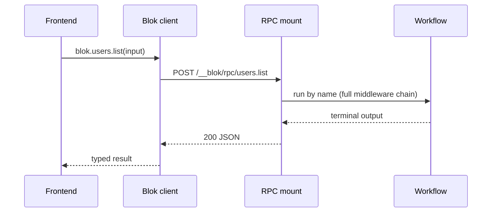

`@blokjs/client` is a tRPC-style client for calling your Blok workflows from a
frontend. You write workflows; the client gives you `blok.users.list(input)`
that is typed on both ends — the input it accepts and the output it returns —
plus `blok.jobs.watch.stream(input)` for typed event streams.

```ts
import { createBlokClient } from "@blokjs/client";
import type { BlokApp } from "./blok-app";        // generated, types only

const blok = createBlokClient<BlokApp>({ baseUrl: "https://api.example.com" });

const { users, total } = await blok.users.list({ q: "ada" });   // typed both ways
```

## The problem it solves

The boundary between a frontend and a backend is usually hand-written and
untyped. Apps hand-roll `fetch` (guessing the method, path, and body shape),
hand-roll an SSE parser for streams, and key off free-string event names. None
of it is type-checked, so a renamed field, a wrong method, or an event that is
never emitted fails silently at runtime.

Blok already has the raw material for a typed bridge: workflows declare a
trigger, and nodes are required to declare Zod schemas. The client surfaces that
as an end-to-end-typed call surface, and deletes the transport and parsing glue.

## How it works

The client is **inference-based**. It imports the server's types only — fully
erased from your bundle — and infers every input, output, and event. There is no
generated runtime code and no manifest. Three pieces make this work:

<Steps>
  <Step title="Workflows carry their types">
    The [`workflow()`](/d/client/typing-workflows) factory reads the optional
    `input`, `output`, and `events` Zod schemas and carries them as phantom
    types on the returned value (`TypedWorkflow<Input, Output, Events>`).
  </Step>
  <Step title="A generated BlokApp type indexes them">
    [`blokctl gen app-types`](/d/cli/gen) walks your workflow files and emits a
    types-only `blok-app.d.ts` that maps each dotted name to its workflow's
    type. You author nothing — the workflow files stay the single source of
    truth.
  </Step>
  <Step title="One mount runs a workflow by name">
    The HTTP trigger exposes `POST /__blok/rpc/:name`. The client's `Proxy`
    turns the access path (`blok.users.list`) into the workflow name
    (`"users.list"`) and POSTs to the mount. The client needs only the dotted
    name and the types — so no manifest and no codegen.
  </Step>
</Steps>



Because the call style encodes the transport, the unary and streaming split
needs no runtime metadata: `blok.users.list(input)` is a unary call;
`blok.jobs.watch.stream(input)` is a stream. The type layer exposes only the
legal one for each workflow.

## Prerequisites

<Columns cols={2}>
  <Card title="The HTTP trigger" icon="globe">
    The `/__blok/rpc/:name` mount is part of the
    [HTTP trigger](/d/triggers/http). It is always on while the trigger runs.
  </Card>
  <Card title="Unique, dotted names" icon="tag">
    Each workflow needs a unique
    [dotted `domain.action` name](/d/introduction/workflows#naming-convention)
    so it nests cleanly into `BlokApp` and reads as `blok.domain.action`.
  </Card>
</Columns>

## What ships today

<Note>
The client is built in phases. This is the current state — examples in these
docs only cover shipped behavior.
</Note>

| Capability | Status |
|---|---|
| Type inference (`import type { BlokApp }`, zero codegen) | Shipped |
| Unary calls — `blok.x.y(input) => Promise<output>` | Shipped |
| Typed streaming — `blok.x.y.stream(input)` over SSE | Shipped |
| `blokctl gen app-types` | Shipped |
| TanStack Query hooks (`useQuery` / `useMutation` / `useStream`) | Planned |
| Codegen fallback (`blokctl gen client` + `GET /__blok/schema`) for JSON-authored, non-TypeScript, or cross-repo clients | Planned |
| Runtime output validation (`BLOK_VALIDATE_WORKFLOW_OUTPUT`) | Planned |

## Next

<Columns cols={3}>
  <Card title="Quickstart" icon="rocket" href="/d/client/quickstart">
    Declare a typed workflow, generate `BlokApp`, and make your first typed
    call.
  </Card>
  <Card title="Typing workflows" icon="braces" href="/d/client/typing-workflows">
    Declare `input`, `output`, and `events` — and type outputs through control
    flow.
  </Card>
  <Card title="Calling workflows" icon="square-function" href="/d/client/unary">
    Client config, error handling, auth, and the RPC wire format.
  </Card>
</Columns>
