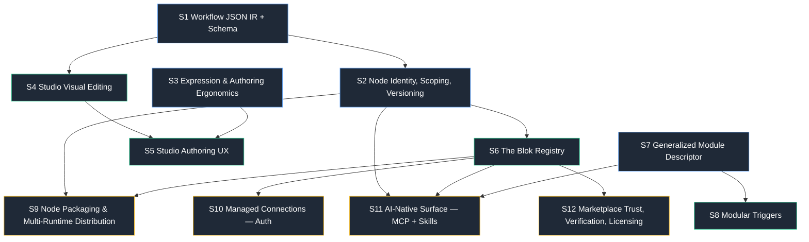

# S0 — Blok Platform Vision & Roadmap

## North star

Blok is the AI-native modular backend framework: typed Nodes composed into Workflow DAGs, where an AI can assemble a production backend in a day by discovering, installing, and wiring nodes and workflows through one CLI kernel — and a human can open the same workflow in a visual Studio canvas and edit it without ever touching the expression syntax by hand. We win by being the only platform that is simultaneously (a) code-first and diffable like Trigger.dev, (b) visual and connect-by-clicking like n8n, (c) multi-runtime like Windmill, and (d) genuinely AI-native (MCP + Skills + steering errors) where every competitor bolted AI on as an afterthought. The canonical TS workflow stays the human source of truth; a published JSON IR is the lossless contract that the canvas, the registry, and the AI all read and write — so every surface composes instead of forking.

## How the 12 specs compose

The suite has four foundation specs that fork the architecture (S1, S2, S3, S7), then two delivery waves built on top. S1 (the JSON IR) is the spine — it's what canvas, registry, and AI all consume. S2 (node identity) gates everything registry/distribution. S7 (the generalized descriptor) is the chassis triggers, nodes, and runtimes all mount onto. S3 ships independently and first because it contains live bug fixes.

**In prose:** S1 promotes today's normalized v2 JSON into a first-class IR with a published JSON Schema. Nothing else can be safely built without it — the canvas needs a write target it can validate (S4), the registry needs a schema to gate publishes against (S6), and the AI needs a grammar to constrain generation against (S11). S2 splits node-name from package-name and introduces mandatory scopes and version-pinned `use:` refs; the registry (S6) and packaging (S9) are meaningless without addressable, versioned identities, and the AI installer (S11) needs them to pin what it installs. S7 generalizes the proven `ObservabilityModuleDescriptor` into one contract; modular triggers (S8) are its first new consumer, and the same contract later mounts nodes and runtimes. S3 is orthogonal — it fixes the branch `when` footgun and caches compiled expression functions — and it must land before S5, because the connect-picker will generate these conditions at scale. S6 is the gravitational center of Phase 3: it gates distribution (S9), the auth primitive (S10), AI install (S11), and trust/licensing (S12).

## The phased roadmap

Smallest-shippable-first. Each phase ends on a demo that is real, not a mock.

### Phase 1 — Foundation (S1, S2, S3, S7)

The forks. Mostly parallel, low-glamour, high-leverage. S3 ships first and alone because it's bug fixes.

- **S3** — Fix branch `when` (route through Mapper or statically reject bare `$`), LRU-cache compiled `Function`s, formalize the small expression surface and the `${}` vs `js/` distinction.
- **S1** — Publish the JSON Schema for the v2 IR; add the optional pass-through `ui: {x?, y?}` field the normalizer ignores at runtime.
- **S2** — Mandatory scopes (`@scope/node@version`), version-pinned `use:` refs, schema versioning (v1 versionless `use`, v2 versioned), plus the `blokctl pin-node-versions` migration command.
- **S7** — Extract the shared descriptor contract; add cycle detection to `resolveWithDependencies()`; fix the config-write/env-write transaction gap.

**Phase 1 demo:** `blokctl validate` rejects an invalid workflow against the published schema with a precise error; the branch `when` footgun that used to 500 silently now fails at author time with a fix hint; a forEach over 1000 items no longer recompiles the same expression 1000 times. Unsexy, but it's the bedrock the next two phases stand on.

### Phase 2 — Studio + Registry + Triggers (S4, S5, S6, S8)

The visible turn: Blok becomes editable and installable.

- **S4** — Studio write path: `PUT …/definition` with `dryRun`, a validation package shared with the CLI, node palette, property inspector, drag/connect, ephemeral dagre positions, undo/redo. Hardest sub-problem: step-id rename propagation (a lint/find-replace pass).
- **S5** — The authoring wins: connect-picker that emits valid `$.state.<id>` (kills the expression footgun for humans), live preview off trace data, run-one-step, and one-click replay-with-edited-payload.
- **S6** — The JSR-architected, npm-protocol-compatible registry: small stateless API + Postgres metadata + CDN object storage, mandatory scopes, immutable-with-yank, Sigstore provenance, a server-side publish gate (schema + secret validation, zero install scripts), and the multi-runtime manifest.
- **S8** — `blokctl trigger add/remove/list` on the S7 descriptor; `.blok/config.json` trigger block; solve the bootstrap-HTTP problem.

**Phase 2 demo:** Open a workflow in Studio, drag from a node's output to summon a filtered palette, drop in `@blok/api-call`, wire its input by clicking (no typed expression), run that one step against live data, see the result, then `blokctl trigger add nats` and publish a node to the registry — all without editing a file by hand.

### Phase 3 — Marketplace + AI + Distribution (S9, S10, S11, S12)

The moat: multi-runtime distribution, the auth primitive, and the AI-native surface.

- **S9** — Per-node packages; each SDK emits a canonical JSON Schema from its typed input; immutable content hash + inline-pinned deps; `blokctl node install --runtime`; the honest "N implementations under one manifest entry" model.
- **S10** — Declarative `type:"app"` managed-connection prop with secret injection — the auth primitive that unlocks third-party integrations.
- **S11** — The Blok MCP server (search / inspect-schema / scaffold / install / test), a steering-error-message audit so failures teach the AI how to fix them, Skills over `blokctl`, and `WorkflowTestRunner` exposed as a `blok_test` tool.
- **S12** — Three trust tiers (local → community-unverified → verified), verified = CI-passes + no-runtime-deps + provenance, plus deprecation and ownership-transfer flows.

**Phase 3 demo:** In a fresh project, an AI assistant (via MCP) searches the registry, inspects a node's schema, installs a Verified Stripe node pinned by hash, scaffolds a workflow, wires a managed Stripe connection without the user ever pasting a key, runs the workflow's tests green, and publishes it — the full "assemble a backend in a day" vision, driven by the model, on the same CLI kernel a human would use.

## Decisions register (D1–D8)

| # | Decision | Recommendation | What it unblocks | Compatibility stance |
|---|---|---|---|---|
| **D1** | Workflow source-of-truth format | TS canonical for humans + **published JSON IR** as the compile target canvas/registry/AI consume. Never make JSON or canvas the truth (round-trip drift). | Visual editing, AI authoring via constrained decoding, marketplace, validation package | **Non-breaking** — formalizes the existing JSON mirror; no author-facing change |
| **D2** | Canvas round-trip model | Ephemeral dagre re-layout for MVP; optional pass-through `ui: {x?, y?}` per step that the normalizer ignores at runtime | Studio editing without polluting the format or triggering merge conflicts | **Non-breaking** — runtime already ignores unknown fields |
| **D3** | Is a node an npm package or a new artifact? | **npm-protocol-compatible Blok registry**, federating to npm for the JS path; thin JSR-style API + Postgres + CDN, custom code off the hot path | Marketplace, MCP install, per-node versioning, cross-runtime distribution | **Additive** — existing `@blokjs/*` npm flow keeps working alongside |
| **D4** | Node identity decoupling | Decouple node-name from package-name; **mandatory scopes**; version-pinned `use:` refs; semver the workflow schema | Independent per-node versioning, reproducible workflows, two coexisting versions | **Breaking, opt-in** — gated behind workflow-schema v2; v1 versionless refs still resolve; `blokctl pin-node-versions` migrates |
| **D5** | Expression language strategy | Two-tier *pragmatically*: keep typed `$`-proxy TS as the power tier; fix branch `when`, add connect-picker + live preview, LRU-cache compiled fns. Evaluate CEL **only** if/when the marketplace runs untrusted expressions | Authoring ergonomics now; the sandbox story later | **Non-breaking** — `$`/`js/` syntax preserved; changes are bug fixes + tooling |
| **D6** | Modular-everything descriptor | Generalize `ObservabilityModuleDescriptor` into one shared contract (id, deps, scaffold/setup/verify/cleanup); add cycle detection; fix the transaction gap. One pattern, four consumers | Modular triggers, modular runtimes, create-time picker, consistent CLI | **Non-breaking** — observability module unchanged; new consumers mount the same contract |
| **D7** | CLI as the single kernel | `blokctl` is the engine; MCP tools and Skills are thin presentation over identical code paths. AI and human must never diverge | AI-native vision, MCP install, Skills | **Non-breaking** — already the observability pattern |
| **D8** | Multi-runtime node packaging reality | Accept the split: a "multi-runtime node" is **N single-language implementations under one manifest entry**, not one binary. Each SDK emits a canonical JSON Schema. Lean into constrained runtimes as the sandboxing differentiator n8n lacks | Honest marketplace scope, the security story | **Non-breaking** — reframes Vision #4; no existing node changes |

**The two decisions that need your sign-off before any spec is written:** D8 (accept the multi-runtime split — it reframes "one node, all runtimes" into "one marketplace entry, N implementations") and the license question below (D-License).

## Business / product decisions you MUST make

### Decision A — License & commercial model (the big one)

Choose this **once, deliberately, up front.** Both n8n and Windmill poisoned community trust by relicensing or paywalling core after the fact. If you want community contributions to the registry, the open/closed boundary has to be set before the marketplace exists — and you must not paywall load-bearing reliability (the alerting and observability you just shipped, or private registries).

| Model | What's open / what you sell | Trade-offs | Best when |
|---|---|---|---|
| **1. Open-core (Apache-2 core + commercial cloud)** | Framework, CLI, SDKs, Studio, MCP server all Apache-2. Sell hosted runtime, managed registry, SSO/RBAC, audit, support | Maximum community + AI-ecosystem trust; broadest contribution. Revenue depends on a real hosted product, which is a separate build. Self-host competitors can fork the cloud feature line | You want the registry to become the default ecosystem and AI tools to standardize on Blok |
| **2. Source-available core (BSL/Elastic-style, time-delayed open)** | Same surface readable + self-hostable, but commercial-use of the hosted-equivalent is licensed; converts to Apache after N years | Protects the cloud business from hyperscaler resale while staying mostly-open. **But this is exactly the move that burned n8n/Windmill** — community reads it as a bait-and-switch even when applied from day one | You're confident a hyperscaler would otherwise resell your cloud and you can absorb some community friction |
| **3. Permissive core + paid Verified/registry tier** | Everything Apache-2; monetize the *trust layer* — Verified badges, private/org registries, managed connections (S10), SLA support | Cleanest community story; monetizes the marketplace itself rather than the engine. Revenue is back-loaded behind marketplace adoption; needs volume | You believe the marketplace + managed connections (S10) is the real product and the engine is the funnel |

**Recommendation: Model 1 (open-core) or Model 3 (permissive + paid trust tier), and decide between them by answering one question — is the *engine* the product, or is the *marketplace* the product?** If the AI-native vision is the bet, the engine must be maximally open so models and tools standardize on it (Model 1/3 territory). Avoid Model 2: it's precisely the relicensing pattern that cost your two closest competitors their community goodwill, and it directly conflicts with "AI assembles a backend from community nodes." Whatever you pick, publish the open/closed boundary as a written, durable commitment now.

### Decision B — Build vs. extend the registry backend

The marketplace is the long pole, and it currently rides a backend you don't fully own (Deskree, no offline mode), in a market where registry-openness precedents are shifting (Pipedream→Workday).

- **Build in-house (recommended):** a thin JSR-architected service — small stateless API, Postgres metadata, CDN object storage, custom code off the hot path. You own the trust model, the multi-runtime manifest, the offline story, and the licensing boundary. It's less code than it looks because you reuse npm's protocol shape rather than inventing one.
- **Extend the existing backend:** faster to a first publish, but you inherit its constraints (no offline, ownership coupling) and bolt the multi-runtime manifest and trust tiers onto a model not designed for them. Acceptable only as a Phase-2 stopgap that S6 explicitly plans to replace.

**This call gates S6 → S9/S10/S11.** Decide it before S6 is specced.

## Risks & how each spec mitigates them

| Risk | Mitigated by |
|---|---|
| **Branch `when` footgun is a live bug** — 500s silently, typecheck and WorkflowTestRunner both miss it | **S3** fixes it first, ahead of any visual work, because **S5**'s connect-picker will generate these conditions en masse |
| **Round-trip drift** if canvas or JSON becomes the source of truth | **S1/D1** keep TS canonical and the JSON IR a lossless projection; **D2** makes positions ephemeral so the format never carries UI state |
| **Step-id rename propagation** silently breaks `$.state.<id>` refs and subworkflow targets | **S4** ships a lint/find-replace propagation pass as a first-class sub-problem, not an afterthought |
| **Node identity decoupling is breaking** | **S2/D4** gates it behind workflow-schema v2; v1 refs still resolve; `blokctl pin-node-versions` migrates in bulk |
| **`typeVersion`-style drift** — n8n's silent marketplace killer | **S6/S9** design node-version migration shims from day one; the normalizer is already better-positioned than n8n's |
| **Marketplace runs untrusted code** | **S6** publish gate forbids install scripts + validates schema/secrets server-side; **S12** trust tiers; **D8** runs untrusted nodes in constrained runtimes, not the host process |
| **Dependency resolver infinite-loops / partial-failure config corruption** | **S7** adds cycle detection and fixes the config-write/env-write transaction gap |
| **Over-building the expression layer** (speculative CEL/JSONata) | **D5** explicitly defers a second language until the marketplace needs sandboxed expressions; Phase-1 fixes cover ~90% of the ergonomics goal |
| **License bait-and-switch** erodes community + AI-ecosystem trust | **Decision A** forces the boundary up front; **S12** binds it to the verification model so it can't drift later |
| **Marketplace depends on a backend you don't own** | **Decision B** + **S6** build the thin in-house registry; the bootstrap-HTTP and offline gaps are explicit S6/S8 scope |

## How this beats n8n / Trigger.dev / Windmill

| | n8n | Trigger.dev | Windmill | **Blok** |
|---|---|---|---|---|
| **Code ↔ visual** | Visual only; canvas is the truth (name-keyed, fragile) | Code only; imperative TS can't render as a graph | Visual DAG + TS projections | **Both, losslessly** — TS canonical, JSON IR feeds the canvas, id-based refs never go fragile (S1/S4) |
| **Authoring ergonomics** | Drag-from-output palette + run-one-step (the speed win to match) | Plain TS, no picker | Connect-picker + per-step test | **Both wins on one surface** — drag-palette *and* a connect-picker that emits valid `$.state.<id>`, run-one-step, replay-with-edited-payload (S5) |
| **Multi-runtime** | Single (Node) | Single (Node) | Multi, but Kafka/NATS triggers Enterprise-gated (wrong move) | **Multi-runtime, common triggers free** — N-impl manifest, constrained runtimes as a *security* feature (S8/S9/D8) |
| **AI-native** | None — canvas isn't text | NL over runs only | AI flow-builder chat | **MCP + Skills over the same CLI kernel** — discover/inspect/scaffold/install/test, steering errors that teach the model to self-correct (S11/D7) |
| **Marketplace + auth** | Two registries, verified = no-runtime-deps | "any npm package" | Hub with Verified badge | **npm-protocol-compatible registry + declarative managed-connection auth** — the integration-unlock primitive plus a clean trust ladder (S6/S10/S12) |
| **Trust posture** | Relicensed; community friction | — | Paywalled core; community friction | **License committed up front, reliability never paywalled** (Decision A) |

**Positioning in one line:** n8n is visual-but-fragile, Trigger.dev is code-but-not-visual, Windmill is multi-runtime-but-gates-the-good-parts — Blok is the only one that is code-first *and* visual *and* multi-runtime *and* AI-native, on a single CLI kernel, with a marketplace whose trust and license boundaries are set before launch.

## Success metrics

**Phase 1 (foundation)**
- 100% of existing `.ts`/JSON workflows validate green against the published schema (zero-regression proof of D1).
- Branch `when` footguns now caught at author time — target: zero silent 500s from bare-`$` predicates.
- forEach expression recompiles eliminated — measurable CPU drop on a 1000-item benchmark.

**Phase 2 (Studio + registry + triggers)**
- Time-to-first-edited-workflow in Studio under 5 minutes for a new user, with **zero hand-typed expressions** in the median session (connect-picker coverage).
- A node published to the registry and installed in a *different* project by `blokctl`.
- ≥3 triggers installable via `blokctl trigger add` on the S7 descriptor.

**Phase 3 (marketplace + AI + distribution)**
- An AI assistant assembles a working multi-step backend (search → install → wire managed connection → test green → publish) **end-to-end via MCP**, no manual file edits — the headline vision, demonstrated.
- ≥1 node shipping ≥2 runtime implementations under a single manifest entry (D8 proof).
- First Verified third-party node in the registry, with Sigstore provenance and a managed connection, installed without the user pasting a secret.
- Leading indicator for the moat: count of community-published nodes/workflows and the share installed via AI vs. by hand.

---

**Two sign-offs gate spec authoring:** (1) **D8** — accept the multi-runtime split. (2) **Decision A** — the license/commercial model, ideally Model 1 or 3, decided before S6. **Decision B** (build the registry in-house) gates S6 and should be confirmed alongside it.

The research dossier this suite is built from lives at [`_research-dossier.md`](./_research-dossier.md); the 16 underlying current-state + competitor briefs are in [`research/`](./research/).
